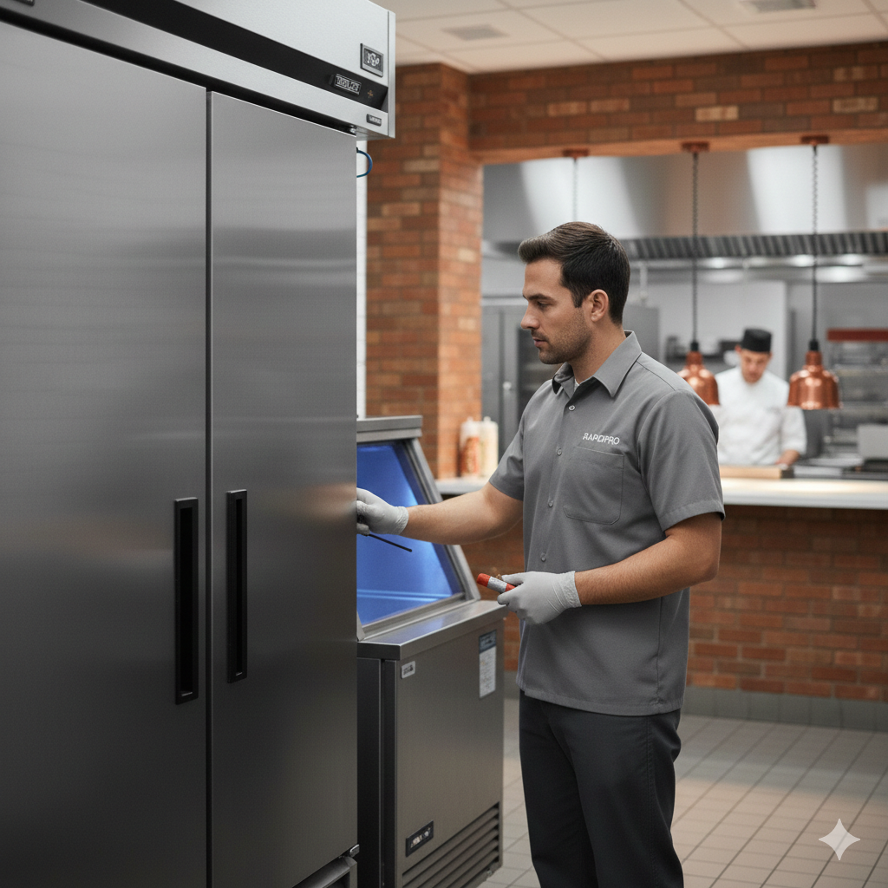

# Reach-In Cooler Not Keeping Temp in Memphis: Quick Q&A for Restaurant Teams

If your reach-in cooler is running but product temperature is climbing, use this quick field checklist before calling for service.

## Who this is for

- Restaurant managers
- Kitchen leads
- Shift supervisors
- Anyone responding to an active refrigeration issue

## Q&A

## Q1: My reach-in cooler is on, but the box is warm. What should I check first?

A:

1. Verify the thermostat setpoint was not changed during cleaning.
2. Confirm the door is fully closing and latching.
3. Check for torn, flattened, or loose door gasket sections.
4. Make sure product is not blocking interior air flow paths.
5. Listen for evaporator fan operation.

## Q2: How do I tell if the door gasket is causing the problem?

A:

- Look for cracks, tears, and hard sections around corners.
- Close the door on a thin paper strip at multiple points.
- If the paper slides out easily, seal pressure is weak in that area.
- Frost around the door frame is another common sign of gasket leak.

## Q3: Should the fans be running in a reach-in cooler?

A:

In most systems, yes. Fans should circulate air across the evaporator and cabinet. If fans are not running, temperature balance fails quickly and product warms unevenly.

## Q4: Could this be an electrical issue?

A:

Yes. Confirm the unit breaker is on and not tripped. Many commercial refrigeration circuits are on dedicated multi-pole breakers depending on equipment size and voltage.

## Q5: What should I check in the breaker panel?

A:

1. Open panel and read the circuit directory on the door.
2. Locate the labeled reach-in cooler circuit.
3. Verify breaker handle position is fully ON.
4. If tripped, follow your facility safety policy before reset.
5. If it trips again, stop resetting and schedule service.

## Q6: What operational habits cause avoidable temperature problems?

A:

- Leaving door open during rush periods
- Overloading shelves so return air is blocked
- Storing hot product before cooling
- Skipping condenser cleaning intervals
- Ignoring gasket wear until failure

## When to call for service immediately

- Product temperature continues rising after basic checks
- Breaker trips repeatedly
- Fans are not operating
- Ice buildup is heavy on evaporator cover
- Compressor short-cycles or does not start

## Memphis operations note

High ambient kitchen temperatures and frequent door openings increase refrigeration load. During peak service, door discipline and clear air flow matter as much as component health.

## Suggested SEO targets

- reach-in cooler not keeping temp memphis
- commercial reach-in cooler repair memphis
- restaurant cooler temperature problems memphis
